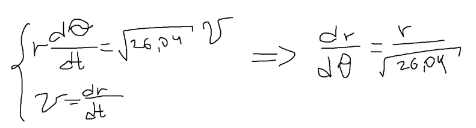
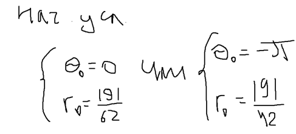
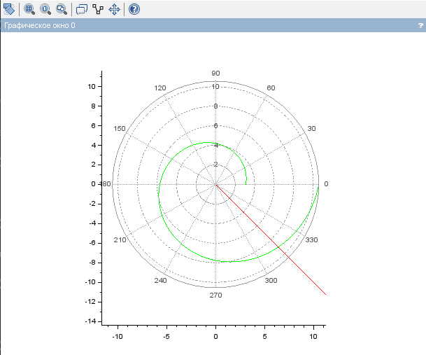
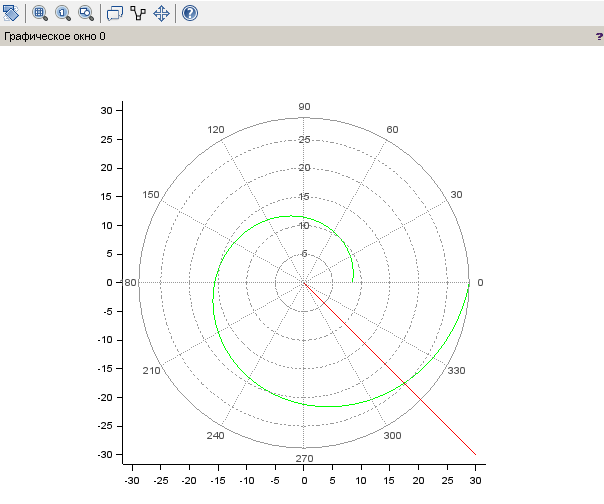
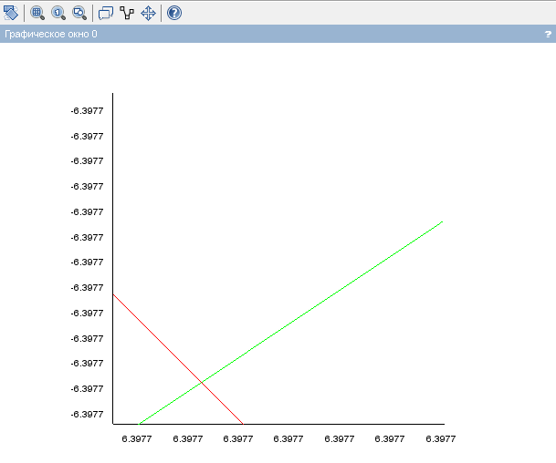
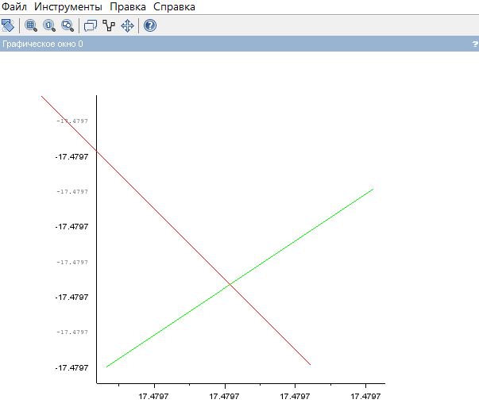

---
# Front matter
title: "Лабораторная работа 2"
author: "Попов Дмитрий Павлович, НФИбд-03-19"

# Generic otions
lang: ru-RU
toc-title: "Содержание"

# Bibliography
bibliography: bib/cite.bib
csl: pandoc/csl/gost-r-7-0-5-2008-numeric.csl

# Pdf output format
toc: true # Table of contents
toc_depth: 2
lof: true # List of figures
lot: true # List of tables
fontsize: 12pt
linestretch: 1.5
papersize: a4
documentclass: scrreprt
## I18n
polyglossia-lang:
  name: russian
  options:
	- spelling=modern
	- babelshorthands=true
polyglossia-otherlangs:
  name: english
### Fonts
mainfont: PT Serif
romanfont: PT Serif
sansfont: PT Sans
monofont: PT Mono
mainfontoptions: Ligatures=TeX
romanfontoptions: Ligatures=TeX
sansfontoptions: Ligatures=TeX,Scale=MatchLowercase
monofontoptions: Scale=MatchLowercase,Scale=0.9
## Biblatex
biblatex: true
biblio-style: "gost-numeric"
biblatexoptions:
  - parentracker=true
  - backend=biber
  - hyperref=auto
  - language=auto
  - autolang=other*
  - citestyle=gost-numeric
## Misc options
indent: true
header-includes:
  - \linepenalty=10 # the penalty added to the badness of each line within a paragraph (no associated penalty node) Increasing the value makes tex try to have fewer lines in the paragraph.
  - \interlinepenalty=0 # value of the penalty (node) added after each line of a paragraph.
  - \hyphenpenalty=50 # the penalty for line breaking at an automatically inserted hyphen
  - \exhyphenpenalty=50 # the penalty for line breaking at an explicit hyphen
  - \binoppenalty=700 # the penalty for breaking a line at a binary operator
  - \relpenalty=500 # the penalty for breaking a line at a relation
  - \clubpenalty=150 # extra penalty for breaking after first line of a paragraph
  - \widowpenalty=150 # extra penalty for breaking before last line of a paragraph
  - \displaywidowpenalty=50 # extra penalty for breaking before last line before a display math
  - \brokenpenalty=100 # extra penalty for page breaking after a hyphenated line
  - \predisplaypenalty=10000 # penalty for breaking before a display
  - \postdisplaypenalty=0 # penalty for breaking after a display
  - \floatingpenalty = 20000 # penalty for splitting an insertion (can only be split footnote in standard LaTeX)
  - \raggedbottom # or \flushbottom
  - \usepackage{float} # keep figures where there are in the text
  - \floatplacement{figure}{H} # keep figures where there are in the text
---

<h1 align="center">

РОССИЙСКИЙ УНИВЕРСИТЕТ ДРУЖБЫ НАРОДОВ 

Факультет физико-математических и естественных наук  

Кафедра прикладной информатики и теории вероятностей

ПРЕЗЕНТАЦИЯ ПО ЛАБОРАТОРНОЙ РАБОТЕ №2
  
<h2  align="right">

дисциплина: Математическое моделирование

Преподователь: Кулябов Дмитрий Сергеевич

Студент: Попов Дмитрий Павлович

Группа: НФИбд-03-19
  
  
<h1 align="center">

МОСКВА

2022 г.
</h1>

# **Прагматика выполнения**

Свободно распространяемая система компьютерной математики Scilab предназначена для выполнения инженерных и научных вычислений.
Знакомство и освоение Scilab значительно упростит процесс работы с математическими моделями для выбора правильной стратегии при решении задач поиска.

# **Цель работы** 

Цель данной работы - научиться выполнять построения математических моделей для выбора правильной стратегии при решении задач поиска.

# **Условия задачи**

Вариант 67

На море в тумане катер береговой охраны преследует лодку браконьеров. Через определенный промежуток времени туман рассеивается, и лодка обнаруживается на расстоянии 19,1 км от катера. Затем лодка снова скрывается в тумане и уходит прямолинейно в неизвестном направлении. Известно, что скорость катера в 5,2 раза больше скорости браконьерской лодки.

# **Задачи работы**

1. Провести рассуждения и вывод дифференциальных уравнений
2. Построить траекторию движения катера и лодки для двух случаев
3. Определить по графику точку пересечения катера и лодки

# **Результаты выполнения лабораторной работы** 

***1 Вывод уравнения движения катера***

Обозначили место нахождения лодки браконьеров в момент обнаружения и место нахождения катера береговой охраны относительно лодки браконьеров в момент обнаружения лодки.

Нашли расстояние, после которого катер начнет двигаться вокруг полюса, время, за которое они пройдут это расстояние.

После того, как катер береговой охраны окажется на одном расстоянии от полюса, что и лодка, он должен сменить прямолинейную траекторию и начать двигаться вокруг полюса удаляясь от него со скоростью лодки v.

Для этого скорость катера разложили на две составляющие:
1. радиальная скорость – это скорость, с которой катер удаляется от полюса.
2. тангенциальная скорость – это линейная скорость вращения катера относительно полюса.

Решение исходной задачи свелось к решению системы из двух
дифференциальных уравнений:

С двумя начальными условиями, зависящими от изначального расположения лодки относительно полюса

***2 Построение траектории движения катера***

Затем построили траекторию движения катера и лодки для первого случая

 

И для второго случая

***3 Нахождение точки пересечения траекторий***

Далее определили по графику точку пересечения катера и лодки.
В первом случае это 6,3977:

Во втором случае это 17,4797:

# **Выводы**

Благодаря данной лабораторной работе я научился выполнять построения математических моделей для выбора правильной стратегии при решении задач поиска.