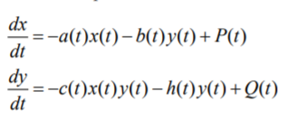

<h1 align="center">

РОССИЙСКИЙ УНИВЕРСИТЕТ ДРУЖБЫ НАРОДОВ 

Факультет физико-математических и естественных наук  

Кафедра прикладной информатики и теории вероятностей

ПРЕЗЕНТАЦИЯ ПО ЛАБОРАТОРНОЙ РАБОТЕ №3
  
<h2 align="right">

дисциплина: Математическое моделирование

Преподователь: Кулябов Дмитрий Сергеевич

Студент: Попов Дмитрий Павлович

Группа: НФИбд-03-19
  
  
<h1 align="center">

МОСКВА

2022 г.
</h1>

# **Прагматика выполнения**

 OpenModelica - свободное открытое программное обеспечение для моделирования, симуляции, оптимизации и анализа сложных динамических систем.
 Знакомство и освоение OpenModelica значительно упростит процесс работы с математическими моделями.

# **Цель работы**

Построение простейших моделей боевых действий – модели Ланчестера

# **Условия задачи**

Вариант 67

Между страной Х и страной У идет война. Численность состава войск исчисляется от начала войны, и являются временными функциями x(t) и y(t). В начальный момент времени страна Х имеет армию численностью 44 200 человек, а в распоряжении страны У армия численностью в 54 100 человек. Для упрощения модели считаем, что коэффициенты
a, b, c, h постоянны. Также считаем P(t) и Q(t) непрерывные функции. Нужно построить графики изменения численности войск армии Х и армии У для
следующих случаев.

# **Задачи работы**

1. Модель боевых действий между регулярными войсками
2. Модель ведение боевых действий с участием регулярных войск и партизанских отрядов

# **Результаты выполнения лабораторной работы** 

**_1 Построение модели боевых действий между регулярными войсками_**

В этом случае модель боевых действий между регулярными войсками описывается следующим образом

Модель боевых действий между регулярными войсками:

Чтобы построить модель, я написал следующий код:

И получил следующий график:

Мы видим что численность армия X быстрее станет равной 0, чем армия Y, если продолжится такая тенденция.

**_2 Построение модели боевых действий между регулярными войсками с партизанскими отрядами_**

В этом случае в борьбу добавляются партизанские отряды, а модель боевых действий между регулярными войсками описывается следующим образом.

Модель боевых действий между регулярными войсками с партизанскими отрядами в моем варианте:

Чтобы построить модель, я написал следующий код:

И получил следующий график:

примерно на 0.002s мы видим что численность армия Y становится близок к 0, в этот момент армия X почти побеждает.

# Выводы

После завершения данной лабораторной работы - я научился выполнять построения математических моделей: Модель боевых действий между регулярными войсками, Модель ведение боевых действий с участием регулярных войск и партизанских отрядов в OpenModelica.

# Список литературы

1. Кулябов, Д.С. - Модель боевых действий
