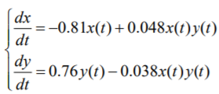
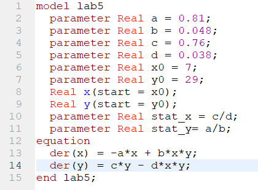
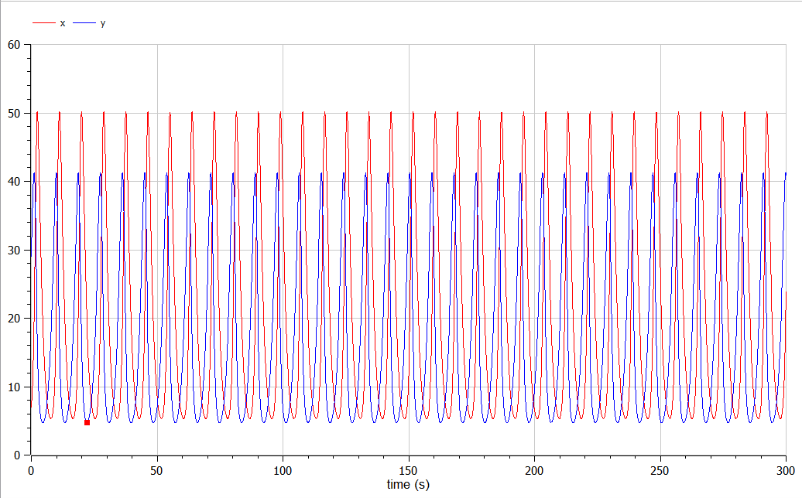
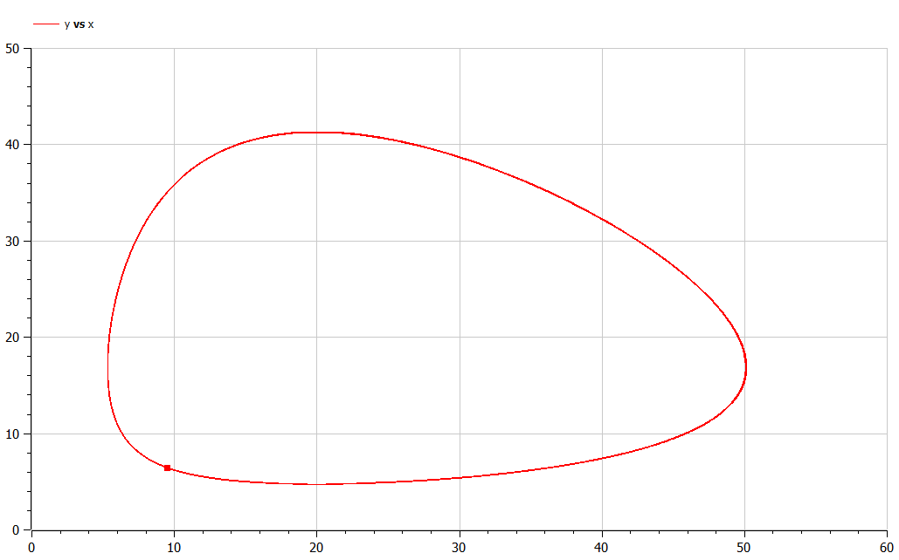

<!-- _class: titleslide -->

#### РОССИЙСКИЙ УНИВЕРСИТЕТ ДРУЖБЫ НАРОДОВ
#### Факультет физико-математических и естественных наук  
#### Кафедра прикладной информатики и теории вероятностей 
#### ПРЕЗЕНТАЦИЯ ПО ЛАБОРАТОРНОЙ РАБОТЕ №5

###### дисциплина: Математическое моделирование
###### Преподователь: Кулябов Дмитрий Сергеевич
###### Студент: Попов Дмитрий Павлович
###### Группа: НФИбд-03-19
МОСКВА
2022 г.

---

# **Прагматика выполнения лабораторной работы**

- знакомство с моделью Лотки-Вольтерры "хищник-жертва"
- работа с OpenModelica

---

# **Цель работы**

Построение модели Лотки-Вольтерры "хищник-жертва"

---

# Задачи выполнения лабораторной работы

Для модели «хищник-жертва»:

Постройте график зависимости численности хищников от численности жертв,а также графики изменения численности хищников и численности жертв при следующих начальных условиях:

x0 = 7, y0 = 29 .

Найдите стационарное состояние системы. 
(интервал t = [0; 300] (шаг = 0.1)).

---

# **Выполнение лабораторной работы**

**_Построение модели Лотки-Вольтерры "хищник-жертва"_**

Модели «хищник-жертва» Варианта 67:

Чтобы построить фазовый портрет модели, я написал следующий код:

---

и получил фазовый портрет модели в варианте для обычной системы, зависящей от времени:

---

и фазовый портрет модели в варианте для параметрической системы:

---

# Результаты выполнения лабораторной работы

- модель в OpenModelica
- графики для модели

---

# Выводы

После завершения данной лабораторной работы - я научился выполнять построение модели Лотки-Вольтерры "хищник-жертва" в OpenModelica.
---