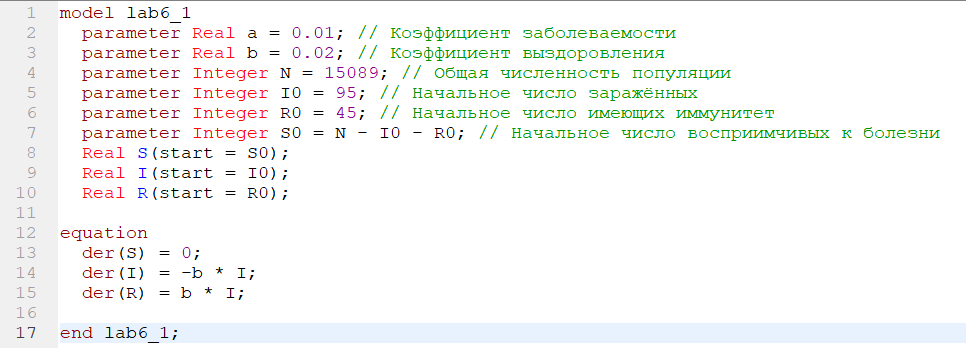
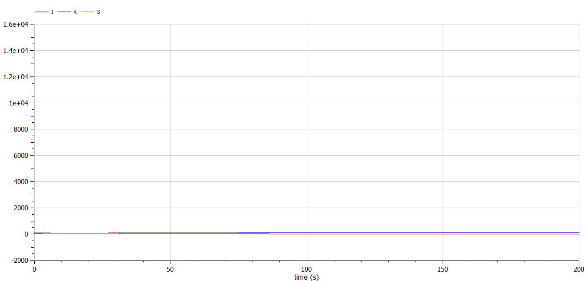
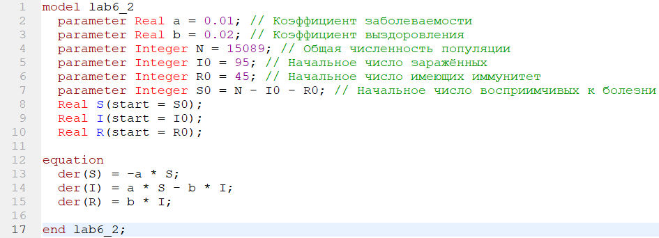
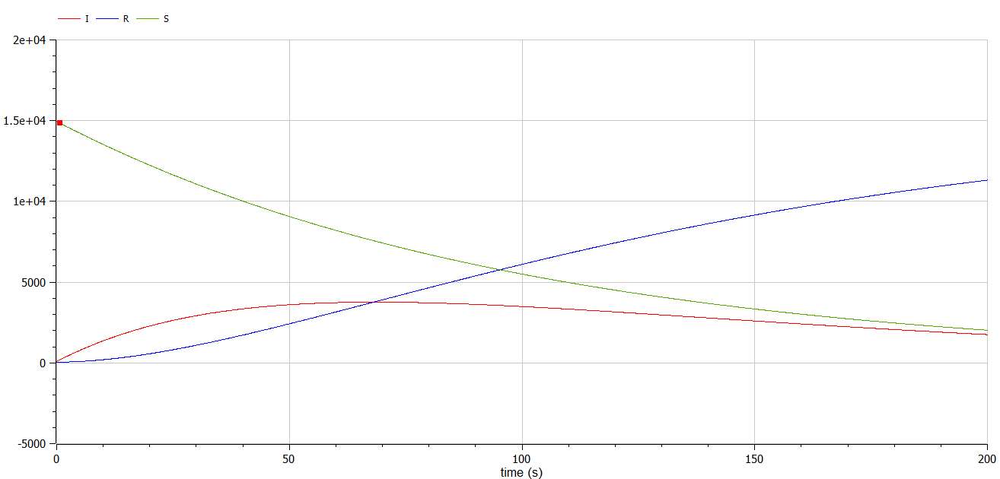

<!-- _class: titleslide -->

#### РОССИЙСКИЙ УНИВЕРСИТЕТ ДРУЖБЫ НАРОДОВ
#### Факультет физико-математических и естественных наук  
#### Кафедра прикладной информатики и теории вероятностей 
#### ПРЕЗЕНТАЦИЯ ПО ЛАБОРАТОРНОЙ РАБОТЕ №6

###### дисциплина: Математическое моделирование
###### Преподователь: Кулябов Дмитрий Сергеевич
###### Студент: Попов Дмитрий Павлович
###### Группа: НФИбд-03-19
МОСКВА
2022 г.

---

# **Прагматика выполнения лабораторной работы**

- знакомство с моделью эпидемии
- работа с OpenModelica

---

# **Цель работы**

Построение модели эпидемии

---

# Задачи выполнения лабораторной работы

Для модели эпидемии:
Вариант 67

На одном острове вспыхнула эпидемия. Известно, что из всех проживающих на острове (N=15 089) в момент начала эпидемии (t=0) число заболевших людей (являющихся распространителями инфекции) I(0)=95, А число здоровых людей с иммунитетом к болезни R(0)=45. Таким образом, число людей восприимчивых к болезни, но пока здоровых, в начальный момент времени S(0)=N-I(0)- R(0). Постройте графики изменения числа особей в каждой из трех групп.
Рассмотрите, как будет протекать эпидемия в случае:

- 1. если I(0) <= I\*
- 2. если I(0) > I\*

---

# **Выполнение лабораторной работы**

**_Построение модели эпидемии_**

Чтобы построить фазовый портрет модели эпидемии для первого случая, я написал следующий код:

---

И получил фазовый портрет модели для обычной системы, зависящей от времени:

---

Чтобы построить фазовый портрет модели эпидемии для второго случая, я написал следующий код:

---

И получил фазовый портрет модели для обычной системы, зависящей от времени:

---

# Результаты выполнения лабораторной работы

- модель в OpenModelica
- графики для модели

---

# Выводы

После завершения данной лабораторной работы - я научился выполнять построение модели эпидемии в OpenModelica.
---